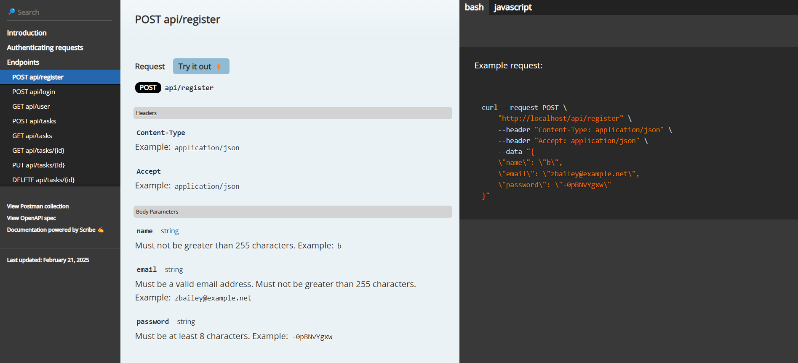

# **Laravel Task Management API**  

## **📌 Overview**  
This is a **RESTful API** built using **Laravel 11** for managing tasks. It includes:  
✅ **User Authentication** (Laravel Sanctum)  
✅ **CRUD operations for Tasks** (Create, Read, Update, Delete)  
✅ **Database migrations**  
✅ **Queue System** (for async task notifications)  
✅ **API Documentation** (Scribe)  
✅ **CI/CD Pipeline** (GitHub Actions)  

---

## **📂 Folder Structure**  
```
/app
 ├── Http
 │    ├── Controllers
 │    │    ├── AuthController.php
 │    │    ├── TaskController.php
 │    ├── Middleware
 ├── Jobs
 │    ├── SendTaskNotification.php
 ├── Models
 │    ├── User.php
 │    ├── Task.php
/database
 ├── migrations
 ├── seeders
/routes
 ├── web.php
 ├── api.php
```

---

## **⚡ Installation & Setup**  
### **1️⃣ Clone the repository**  
```sh
git clone <repository_url>
cd task-manager-backend
```

### **2️⃣ Install Dependencies**  
```sh
composer install
```

### **3️⃣ Configure the `.env` file**  
1. Copy the `.env.example` file:  
   ```sh
   cp .env.example .env
   ```
2. Set up your database connection:  
   ```
   DB_CONNECTION=mysql
   DB_HOST=127.0.0.1
   DB_PORT=3306
   DB_DATABASE=task_manager
   DB_USERNAME=root
   DB_PASSWORD=your_password
   ```

### **4️⃣ Run Migrations & Seed Database**  
```sh
php artisan migrate
```

### **5️⃣ Generate Application Key**  
```sh
php artisan key:generate
```

### **6️⃣ Start the Laravel Development Server**  
```sh
php artisan serve
```
Now, the API is accessible at `http://127.0.0.1:8000`.

---

## **🛠️ API Endpoints**  
### **Authentication (Public)**
| Method | Endpoint | Description |
|--------|------------|-------------|
| `POST` | `/api/register` | Register a new user |
| `POST` | `/api/login` | Login & get access token |

### **Task Management (Protected)**
| Method | Endpoint | Description |
|--------|------------|-------------|
| `POST` | `/api/tasks` | Create a new task |
| `GET` | `/api/tasks` | Get all tasks for the logged-in user |
| `GET` | `/api/tasks/{id}` | Get a single task |
| `PUT` | `/api/tasks/{id}` | Update a task |
| `DELETE` | `/api/tasks/{id}` | Delete a task |

🔹 **All protected routes require a Bearer Token in the Authorization header.**  

Example:  
```
Authorization: Bearer YOUR_ACCESS_TOKEN
```

---

## **🔐 User Authentication (Laravel Sanctum)**
This API uses **Laravel Sanctum** for token-based authentication.  
- When a user logs in, they receive an **access token**.  
- This token must be sent in the **Authorization header** of all protected API requests.  

---

## **📌 Running Queued Jobs**
This API uses **Laravel Queues** for sending task notifications.  
1. Make sure your `.env` file has:
   ```
   QUEUE_CONNECTION=database
   ```
2. Run the following commands:
   ```sh
   php artisan queue:table
   php artisan migrate
   php artisan queue:work
   ```
3. Now, when a new task is created, a **background job** will log a notification.

---

## **📜 API Documentation**
This API uses **Scribe** to generate API documentation.  
To regenerate docs, run:  
```sh
php artisan scribe:generate
```
📌 Visit: [`http://127.0.0.1:8000/docs`](http://127.0.0.1:8000/docs)


---

## **🛠️ Running Tests**
This project includes basic API tests.  
Run the tests using:  
```sh
php artisan test
```

---

## **📦 CI/CD with GitHub Actions**
This project includes a **GitHub Actions workflow** to **automate testing on each push**.  

### **Workflow File: `.github/workflows/laravel.yml`**
```yaml
name: Laravel CI

on: [push, pull_request]

jobs:
  build:
    runs-on: ubuntu-latest

    steps:
    - uses: actions/checkout@v3
    - name: Set up PHP
      uses: shivammathur/setup-php@v2
      with:
        php-version: 8.2
        extensions: mbstring, bcmath, pdo_mysql
        tools: composer

    - name: Install Dependencies
      run: composer install --prefer-dist --no-progress

    - name: Run Tests
      run: php artisan test
```
✅ This **automatically runs tests** when code is pushed to GitHub.

---

## **🚀 Deployment**
This API can be deployed to **Railway, Heroku, or DigitalOcean**.

Example for **Railway**:
1. Install the CLI:
   ```sh
   npm i -g @railway/cli
   railway login
   ```
2. Deploy:
   ```sh
   railway up
   ```

---

## **📌 Contributors**
- **Hussein Bouik** (Lead Developer)

---

## **📜 License**
This project is licensed under the **MIT License**.

---

## **🎯 Final Notes**
This API is **ready for frontend integration**! 🚀🔥  
